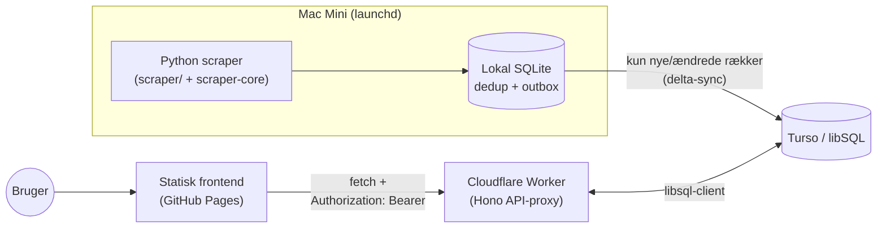

# scraper-boilerplate

Skabelon-repo (tænkt som GitHub "template repository") for mønsteret:

**Python-scraper på en Mac Mini (launchd) → lokal SQLite → delta-sync til Turso/libSQL
→ Cloudflare Worker (API-proxy) → statisk vanilla HTML/JS-frontend på GitHub Pages.**

Bygget fordi mønsteret var håndrullet tre gange med inkonsistent secrets-håndtering,
manuel provisionering og kosmetisk client-side "auth". Formålet er at et nyt projekt
i praksis kun kræver: "Use this template", ét bootstrap-workflow, ét CLI-kald for at
oprette den første bruger, og `make install-launchd` på Mac'en.

## Arkitektur



Nøgleprincipper:
- **Delta-writes, aldrig fuld-tabel-rewrites.** Dedup/"seen"-logik holdes lokalt i
  SQLite; kun nye/ændrede rækker sendes til Turso, i en batch pr. kørsel.
- **Én Worker pr. projekt**, ikke én pr. bruger. Auth er et `Authorization: Bearer`-
  token i `localStorage`, IKKE en cookie og IKKE en delt API-nøgle i frontend-JS.
  Cookie-baseret session blev afprøvet først og fejlede reelt i Safari (ITP blokerer
  alle third-party-cookies uanset `SameSite`, da frontend og Worker ligger på
  forskellige domæner) — se `worker/src/middleware.ts`s kommentar og
  `SCRAPING_LESSONS.md`.
- **Ingen håndrullet HTTP** mod Tursos `/v2/pipeline` - altid den officielle
  `libsql-client`-SDK (Python og TypeScript), altid parameterbinding.
- **Alt er variabelt via `.env`/secrets** - ingen hemmeligheder i kode, YAML eller
  `wrangler.toml`.

## Repo-struktur

```
scraper/                  Python-scraper for DETTE projekt (dummy-eksempel inkluderet)
packages/scraper-core/    Delt, separat pip-installérbar pakke (se dens egen README)
worker/                   Cloudflare Worker (Hono, TypeScript) - API-proxy + auth
frontend/                 Statisk vanilla HTML/JS (login + data-visning)
infra/                    provision.sh, add-user.sh, destroy.sh + delte lib-scripts
infra/launchd/            launchd .plist-template til Mac Mini'en
.github/workflows/        bootstrap.yml, deploy.yml, ci.yml
Makefile                  `make install-launchd` osv.
```

## Nyt projekt på 10 minutter

**Vigtigt, tjek FØR første bootstrap-kørsel: Organization → Settings → Actions →
General → Workflow permissions skal være sat til "Read and write permissions"**
(org-niveau, og/eller tilladt per-repo). Nogle GitHub-organisationer har som
standard/politik "Read permissions" org-bredt — det blokerer `provision.sh`s
commit-tilbage-trin med en 403 ("Resource not accessible by integration"),
uanset hvad selve workflow-filens egen `permissions:`-blok beder om. En
workflow-fil kan kun indskrænke org/repo-loftet, aldrig udvide det.
`provision.sh` fejler ikke hårdt på dette (Turso/Worker-provisionering
fortsætter), men commit-tilbage kræver rettelsen.

**Vigtigt, ÉT ENGANGS-TRIN pr. projekt: kør `./infra/finish-bootstrap-locally.sh`
lokalt, med en gang eller lige efter bootstrap.yml.** To ting kræver dette:
GitHub Pages-aktivering og repo-secrets-skrivning kan **aldrig** lykkes via
`GITHUB_TOKEN` (workflowets ephemer CI-identitet inde i `bootstrap.yml`) —
ikke fordi det mangler et permission-flag, men fordi begge er administrative
handlinger GitHub kun tillader for en rigtig, autentificeret bruger-/agent-
session, uanset hvad `permissions:`-blokken erklærer eller hvad org/repo's
"Workflow permissions" er sat til (bekræftet mod GitHubs API).

Dette er **ikke** "et menneske skal klikke i browseren" — det er "skal køre
uden for `GITHUB_TOKEN`s ephemer CI-kontekst". Enhver med en allerede-
autentificeret `gh`-session på maskinen (et menneske, eller en agent der
selv driver provisioneringen — begge virker identisk) kan bare køre scriptet
selv, uden ny credential. Bevidst IKKE løst med en gemt PAT/org-secret i
stedet: en permanent, bredere-end-`GITHUB_TOKEN`-legitimation er en dårligere
handel end en lejlighedsvis lokal kommando, for et problem der reelt kun
opstår én gang pr. projekt (se `docs/SCRAPING_LESSONS.md`).

`provision.sh` fejler ikke hårdt på nogen af de to (Turso/Worker-
provisionering fortsætter uanset), men advarer og peger på scriptet.

**Vigtigt: nye projekter skal oprettes som OFFENTLIGE repos** (`gh repo create ... --template fddigi/scraper-boilerplate --public`, IKKE `--private`). Årsag: GitHub-organisationens gratis plan tillader kun deling af organisation-level secrets med offentlige repos ("Organization secrets cannot be used by private repositories with your plan") — private repos ville se alle fire org-secrets som tomme strenge i Actions, uden nogen fejlmelding, hvilket blokerer hele bootstrap-flowet. Ingen hemmeligheder committes nogensinde i selve koden (kun `wrangler secret put`/repo-secrets), så offentlig synlighed af kildekoden er et bevidst, sikkert valg her — samme mønster som PLAGG-projektet allerede bruger.

| # | Trin | Manuel / automatisk |
|---|------|---------------------|
| 1 | Klik "Use this template" på GitHub (eller `gh repo create <navn> --template fddigi/scraper-boilerplate --public --clone`) og navngiv det nye repo | **Manuel** (klik/kommando) |
| 2 | Sæt organisation-secrets ÉN GANG for hele din GitHub-organisation: `TURSO_PLATFORM_TOKEN`, `TURSO_ORG`, `CLOUDFLARE_API_TOKEN`, `CLOUDFLARE_ACCOUNT_ID`, og valgfrit `HEALTHCHECKS_API_KEY` | **Manuel** (kun første gang, arves af alle fremtidige projekter) |
| 3 | Kør workflowet "Bootstrap new project" (Actions-fanen → workflow_dispatch) | **Manuel trigger, automatisk indhold** - opretter Turso-db, deployer Worker + secrets |
| 4 | `git clone` det nye repo lokalt / på Mac Mini'en, kør `./infra/finish-bootstrap-locally.sh` (aktiverer Pages + skriver repo-secrets — `GITHUB_TOKEN` kan aldrig gøre nogen af delene, se boks ovenfor) | **Manuel kald, lokalt, idempotent** |
| 5 | `cp .env.example .env`, kør `./infra/local-turso-env.sh --write` (kræver `turso auth login` — se "Lokal Turso-adgang" nedenfor) for at udfylde `TURSO_DATABASE_URL`/`TURSO_AUTH_TOKEN`, og evt. `HEALTHCHECK_URL` manuelt fra repo-secrets | **Manuel kald, automatisk udfyldning** |
| 6 | `./infra/add-user.sh` (secret-mode, default) - opretter admin-login | **Manuel kald, automatisk logik** - password vises ÉN gang |
| 7 | ~~Ret `frontend/config.js`~~ — sket automatisk i trin 3 (`provision.sh` udfylder og committer `API_BASE`) | **Automatisk** |
| 8 | `make venv && make install-launchd` på Mac Mini'en | **Manuel kald, automatisk resten** - venv, launchd-plist, `launchctl load` |
| 9 | Åbn GitHub Pages-URL'en, log ind, se data | **Manuel verifikation** |
| 10 | Fremtidige pushes til `main` deployer Worker automatisk (`deploy.yml`); Pages opdaterer sig selv fra branchen | **Automatisk** |

Alt andet (schema-migration, secrets-hygiejne, CORS-lås, rate-limiting,
delta-sync-logik) er allerede bygget ind i skabelonen - der er intet at "huske"
per projekt ud over ovenstående ni klik/kommandoer.

## Lokal Turso-adgang (`infra/local-turso-env.sh`)

Uden dette trin viser frontend'en altid en tom liste, selvom scraperen kører
fint lokalt: den lokale scraper skriver til en ANDEN Turso-forbindelse end den,
Worker'en læser fra, medmindre `.env`'s `TURSO_DATABASE_URL`/`TURSO_AUTH_TOKEN`
faktisk peger på den rigtige database.

`TURSO_AUTH_TOKEN` bliver ALDRIG logget eller gemt noget sted efter
`bootstrap.yml` har kørt - den bruges kun momentant til at sætte Worker'ens
egen secret. Det er ikke en fejl, det er write-once-by-design for en
hemmelighed. Løsningen er ikke at "finde" det oprindelige token igen, men at
mint et NYT token til lokal brug:

**Forudsætning, ÉN GANG PR. MASKINE (ikke pr. projekt):**
```bash
turso auth login   # interaktiv, åbner en browser
```

**Pr. projekt, når som helst du har brug for lokal sync:**
```bash
./infra/local-turso-env.sh           # printer TURSO_DATABASE_URL/TURSO_AUTH_TOKEN til at kopiere ind
./infra/local-turso-env.sh --write   # eller lad den selv opdatere .env
```

Bevidst IKKE baseret på `TURSO_PLATFORM_TOKEN` (org-secreten `provision.sh`
bruger til automatiseret provisionering) - det er et langt mere magtfuldt,
org-bredt token, og hører ikke hjemme i en lokal `.env`-fil pr. udvikler-
maskine. Et `turso auth login`-mintet token er personligt og til enhver tid
selvstændigt tilbagekaldeligt uden at påvirke provisioneringen af andre
projekter.

## Brugeradministration (`infra/add-user.sh`)

To modes, styret via flag:

```bash
# v1 default: sætter ADMIN_USER/ADMIN_PW_HASH som Worker-secrets.
# Workeren tjekker login direkte mod disse to secrets - `users`-tabellen
# findes fra v1, men bruges ikke i denne mode.
./infra/add-user.sh
./infra/add-user.sh --secret-mode --username admin

# Fremtidig multi-user mode: INSERT/UPDATE i `users`-tabellen i Turso.
# Kræver at Worker'ens /login-handler ombygges til et table-lookup først
# (skemaet er klar fra dag ét, men denne omlægning er bevidst ikke automatisk).
./infra/add-user.sh --table-mode alice
```

Begge modes genererer et 20-tegns kryptografisk tilfældigt password
(`openssl rand -base64 15`), hasher det med PBKDF2-HMAC-SHA256 (samme metode og
parametre som Worker'en bruger til at verificere det), og printer passwordet ÉN
gang til terminalen. Det gemmes ingen andre steder af scriptet - skriv det ned i
en password-manager med det samme.

**Password-reset** = kør scriptet igen for samme bruger. Det overskriver hashen.
Der er bevidst ingen reset-mail og ingen 2FA - det er fravalgt for hobby-skala med
én (eller nogle få) brugere; en reel reset-mail-flow ville kræve en mailudbyder og
et sikkert engangslink-system, som er overkill her.

## Nedlæggelse af et projekt (`infra/destroy.sh`)

```bash
./infra/destroy.sh          # dry-run: viser hvad der ville blive slettet
./infra/destroy.sh --yes    # sletter for alvor: Worker, KV, Turso-db (+ alle dens
                             # tokens), GitHub Pages, og de repo-secrets provision.sh skrev
```

Irreversibelt - al data i Turso-databasen forsvinder. Kør uden `--yes` først for at
se præcis hvad der ville ske.

## Lokal udvikling og test

```bash
# Python (scraper-core + dummy-scraper)
make venv
make test          # unit-tests for delta-sync (mocket Turso-klient)
make lint          # ruff

# Kør scraperen lokalt uden nogen Turso-konto (graceful fallback til lokal-only):
.venv/bin/python -m scraper.main

# Worker (Cloudflare)
cd worker
npm install
npx tsc --noEmit   # typecheck
npx vitest run     # unit-tests for password-hash / session-token-logik
npx wrangler dev    # lokal dev-server (kræver ikke live Cloudflare-deploy)

# Fejlsøger et RIGTIGT (ikke wrangler-dev) miljøs KV-indhold? `wrangler kv
# key list/get/put/delete` rammer som standard en LOKAL simuleret butik,
# ikke den rigtige Cloudflare KV, selv med et rigtigt namespace-id - tilføj
# altid --remote:
npx wrangler kv key list --namespace-id <id> --remote
```

## Secrets-hygiejne

- Al konfiguration læses fra `.env` (gitignored) via pydantic-settings.
  `.env.example` er den ene sandhedskilde for alle variabelnavne, inkl. dem der
  reelt lever som `wrangler secret` / GitHub-secrets og ikke i `.env` selv.
- `wrangler.toml` indeholder kun placeholder-værdier og kommentarer om hvilke
  `wrangler secret put`-kald der skal køres.
- `.gitleaks.toml` + `.pre-commit-config.yaml` scanner for secrets før commit;
  samme scan kører i `ci.yml`.

## Gratis tiers (ingen betalte tjenester påkrævet)

- Turso free: 100 databaser, 5 GB storage, 500M reads / 10M writes pr. måned.
- Cloudflare Workers free: 100.000 requests/dag (kontoniveau, deles på tværs af
  alle Workers på kontoen - hold det for øje hvis du kører flere projekter).
- GitHub free: ubegrænsede offentlige repos, Actions-minutter til hobby-brug, Pages.
- Healthchecks.io free (valgfrit): 20 checks - rigeligt til én pr. projekt.

## Valideret i praksis

Denne skabelon ER nu kørt ende-til-ende mod rigtige Cloudflare-, Turso- og
GitHub-konti — ikke kun syntaks-valideret. Det første rigtige projekt bygget
herpå (`pa-speakers`) fandt og rettede 25 konkrete fund undervejs, heraf flere
alvorlige (bl.a. et login-system der var 100% ødelagt i produktion pga. en
PBKDF2-iterationsgrænse ingen lokale tests fangede, og en cookie-baseret
session der virkede i Chrome men ikke Safari). Alle skabelon-niveau-fund er
rettet i denne repos historik — se `docs/SCRAPING_LESSONS.md` og commit-loggen
for detaljer. Kendte, resterende begrænsninger (dokumenteret, ikke skjulte):

- GitHub Pages-aktivering og repo-secrets-skrivning kræver begge ét lokalt
  engangs-kald (`./infra/finish-bootstrap-locally.sh`, se boks ovenfor) —
  bekræftet, hårde platformsbegrænsninger på `GITHUB_TOKEN` som CI-identitet,
  ikke noget der kan/bør automatiseres væk via en permanent, mere magtfuld
  credential i stedet.
- `make install-launchd` er valideret separat (`plutil -lint` på den genererede
  plist) men ikke kørt for alvor i selve skabelon-udviklingen — det ville
  registrere et rigtigt baggrundsjob. `pa-speakers`s eget
  `com.pa-speakers.scraper`-job (kørt via denne mekanisme) beviser mønstret
  fungerer i praksis.
- Dummy-scraperen (`scraper/scraper/sources/jsonplaceholder.py`) er kørt
  end-to-end flere gange, inkl. verifikation af at dedup virker korrekt.

### Din tur: sådan aktiverer du det for første gang

1. Push dette repo til dit eget GitHub-repo (ikke gjort af denne skabelon - intet
   remote er konfigureret).
2. Slå "Template repository" til under repoets Settings.
3. Sæt de fire (plus valgfrit `HEALTHCHECKS_API_KEY`) organisation-secrets nævnt
   i tjeklisten ovenfor, og bekræft org-niveau "Workflow permissions".
4. Opret et nyt repo fra skabelonen, kør `bootstrap.yml` (trin 3), og kør
   derefter `./infra/finish-bootstrap-locally.sh` lokalt (trin 4).

## Afvigelser fra opgavebeskrivelsen

- **Vitest kunne ikke køres direkte i dette repos egen sti** under udviklingen,
  fordi stien indeholder tegnet `#` (`.../# Claude tmux/...`), hvilket Vite
  fejlfortolker som en URL-fragment-markør. Selve testkoden er verificeret ved at
  køre den samme testsuite i en kopi af `worker/` uden på en sti uden `#` (alle 9
  tests bestod) - dette er en kvirk ved denne specifikke lokale mappe, ikke en fejl
  i koden, og vil ikke optræde i en normal GitHub Actions-checkout eller på en
  normal lokal sti.
- `Makefile` bruger bash `${var//search/replace}` i stedet for `sed 's#...#...#'`,
  og `$(shell basename "$(CURDIR)")` i stedet for `$(notdir $(CURDIR))` - begge
  fordi denne repos egen sti indeholder mellemrum og `#`, som ellers ville
  ødelægge hhv. sed's afgrænsningstegn og GNU Makes indbyggede path-funktioner
  (som splitter på whitespace). Løsningen er mere robust end den oprindelige plan
  og fungerer også på almindelige stier uden specialtegn.
